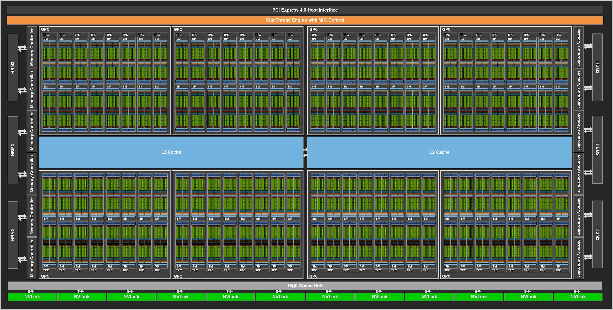
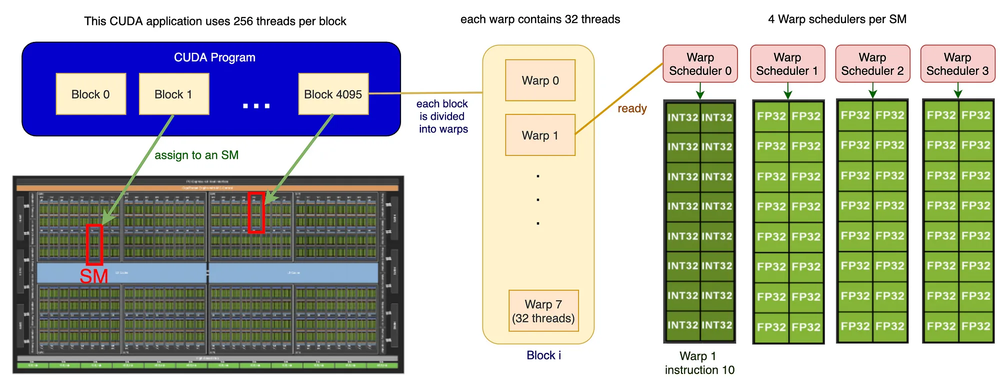

# 实验三：GEMM 通用矩阵乘法

## 1 实验简介

**BLAS**（英语：**Basic Linear Algebra Subprograms**，基础线性代数程序集）是一个[应用程序接口](https://zh.wikipedia.org/wiki/应用程序接口)（API）标准，用以规范发布基础线性代数操作的数值库（如矢量或矩阵乘法）。该程序集最初发布于 1979 年，并用于创建更大的数值程序包（如 [LAPACK](https://zh.wikipedia.org/wiki/LAPACK)）。[1] 在高性能计算领域，BLAS 被广泛使用，numpy 的底层也依赖于 BLAS。

通用矩阵乘法（[General matrix multiply](https://en.wikipedia.org/wiki/General_matrix_multiply), GEMM）是 BLAS 中经典的子程序之一。[2] 作为当今科学计算最常见的计算任务之一，GEMM 需要实现一个非常高效的矩阵乘法。优化 GEMM 也是 HPC 界非常基础的任务。

本次实验需要你使用 CUDA 完成一个高性能 GEMM 实现。

你可以自由选择使用 CUDA Runtime API 或者 CUDA Driver API 进行编程，但不能调用高性能计算的 Library 代替你自己实现 GEMM。本实验推荐采用 CUDA Runtime API，使用更加简单方便，相较 Driver 几乎不损失性能。

<div align="center">
  
</div>

## 2 实验环境

本实验提供了一个使用 `slurm` 管理的 GPU 节点（GPU06），在分区 2080Ti 中。该节点包含 2 张 Nvidia RTX 2080Ti，可供 2 位同学同时使用，每次使用限制时长为 10 分钟。

#### 2.1 登录

登录方式：

``` bash
ssh <username>@clusters.zju.edu.cn -p 80
```

其中 `username` 为 `{你的姓名缩写}` ，例：王小明的用户名为 `wxm`。

> 登录节点为内存 20GB 的家用 pc，请不要使用 vscode-remote-ssh 等对内存消耗大的工具

#### 2.2 编译

集群上已经安装好了 `HPC SDK` 工具，通过如下的指令加载环境：

``` bash
module load nvhpc/23.5
```

我们提供了一份 [Makefile](code/Makefile) 供参考，需要与 [baseline.cu](code/baseline.cu) 放在同一目录下，使用 `make` 进行编译，可以在其中修改编译参数。您也可以使用 `nvcc` 编译器进行编译，编译指令示例如下：

``` bash
nvcc baseline.cu -o gemm -lcublas -O3 -cudart=shared -Xcompiler -fopenmp -arch=sm_75
```

#### 2.3 运行

> 由于 2080Ti 的计算能力是 7.5，不能使用 Double 类型的 Tensor Core。因此在本次实验中，如果您**写完了 Tensor Core 的代码**，则可以在 A100 的节点上进行测试，且只允许使用 `srun` 或者 `sbatch` 提交任务。

以下三种方法都是可以的，但是我们推荐使用 `srun` 或者 `sbatch` 提交任务，避免因为手动运行忘记退出而导致的资源浪费。

- 使用 `srun` 把任务提交至任务队列
```bash
srun -p 2080Ti -N 1 -n 1 --cpus-per-task=8 --gpus=1 gemm
```

- 使用 `sbatch` 提交任务至任务队列，需要编写 `job.sh` 文件，示例见 [此处](code/job.sh)
```bash
# 在运行前，请确保能申请的机器能够访问在 job.sh 中需要访问的文件
sbatch job.sh
# 之后输出的内容中是这样的形式
# job.%j.out
# 其中 %j 为任务的 id，可以通过 cat job.%j.out 查看任务的输出
```

- 使用 `salloc` 请求集群资源，待资源分配完毕后手动运行
```bash
salloc -p 2080Ti -N 1 -n 1 --cpus-per-task=8 --gpus=1
ssh GPU06
./gemm
# 注意在结束任务之后需要手动退出以避免对服务器资源的占用
exit
exit
# 如果没有正确退出，也可以尝试如下指令
# scancel <job_id>
# 其中，<job_id> 为 salloc 返回的内容
# 如 "salloc: Granted job allocation 114"，则 job_id 为 114
# 此外，也可以使用 squeue 查看当前正在运行的任务
```

> 使用 salloc 的方法时可能会出现无法独占资源的情况 （两人共用一张卡），请尽量减少 salloc 方法的使用，或者添加 `--exclusive` 选项独占节点

单次任务的最大运行时间为 10 分钟。**在实验截止日期前一周，最大运行时间将会减少。**

#### 2.4 集群状态获取

可以通过 `sinfo` 获取当前集群的状态，通过 `squeue` 获取排队的任务信息。如果当前自己的任务正在运行，则你可以通过 `ssh` 连接到各个计算节点通过 `htop` 等命令观察运行情况。

## 3 实验基础知识介绍

### 3.1 程序局部性

> 此部分介绍参考自 [wiki](https://en.wikipedia.org/wiki/Locality_of_reference)

程序局部性指的是应用程序在访问内存的时候，倾向于访问内存中较为靠近的值。

一般来说，程序的局部性分为两种形式，一种是时间局部性，另一种是空间局部性。时间局部性指的是，程序在运行时，最近刚刚被引用过的一个内存位置容易再次被引用，比如在调取一个函数的时候，前不久才调取过的本地参数容易再度被调取使用。空间局部性指的是，最近引用过的内存位置以及其周边的内存位置容易再次被使用。空间局部性比较常见于循环中，比如在一个数列中，如果第 3 个元素在上一个循环中使用，则本次循环中极有可能会使用第 4 个元素。

局部性是出现在计算机系统中的一种可预测行为。系统的这种强访问局部性，可以被用来在处理器内核的指令流水线中进行性能优化，如缓存，内存预读取以及分支预测。实现好程序的局部性，对于我们这次的 GEMM 实现具有相当的意义。

### 3.2 计算机层次存储结构

存储层次是在计算机体系结构下存储系统层次结构的排列顺序。一般来说，每一层相对于下一层拥有着更高的速度和更低延迟，以及更小的容量。

<div align="center">
  
</div>

层次存储的设计核心目的就是要充分利用程序的局部性，如将最常访问的数据放置在较高的层级来保证访问速度；再比如按照顺序访问能够使得每次取来的整块数据都能够被利用，也使得预取的数据是有效的；如果你的内存充足，你甚至可以将硬盘上的数据提前拷贝到内存，来避免硬盘 I/O 带来的开销。对于 GPU 程序而言，合理安排层次程序也是相当重要的一件事情。

### 3.3 GPU 总览

> 以下内容以 [AI Chips: A100 GPU with Nvidia Ampere architecture](https://jonathan-hui.medium.com/ai-chips-a100-gpu-with-nvidia-ampere-architecture-3034ed685e6e) 为参考，如果有不清楚的地方可以参考原文章、自行搜索或者向我们询问。

类比计算机层次存储结构，我们对 GPU 结构，尤其是存储方面进行一定的了解。进行以 Nvidia Ampere 架构为例，完整的 GA100 核心如下所示（A100 并不是完整的 GA100 核心）：

<div align="center">

</div>

它包含：

- 8 GPC and 16 SM/GPC and 128 SMs per full GPU.
- 6 HBM2 stacks and 12 512-bit Memory Controllers.

下面将回顾一些可能对完成本次 Lab 比较有帮助的一些内容。

#### 3.3.1 Streaming Multiprocessor

每一个 Streaming Multiprocessor（下简称 SM），包含有：

- 4 processing block/SM, 1 Warp scheduler/processing block.
- 64 INT32 CUDA Cores/SM, 64 FP32 CUDA Cores/SM, 32 FP64 CUDA Cores/SM.
- 192 KB of combined shared memory and L1 data cache.
- 4 Tensor Cores/SM.

<div align="center">
  
</div>

#### 3.3.2 warp

一个 block 在一个 SM 上执行，并在执行时进一步被细分为 warp。每个 warp 一次可以处理 32 threads。为了提高利用率，**推荐你按照 warp 进行块的划分**。下图为一个 block 包含 256 threads（即 8 warps）时执行的示意图：

<div align="center">
  
</div>

#### 3.3.3 Shared Memory

上面提到过一个 SM 包含 192KB 的 L1 Data Cache / Shared Memory。这些内存相对于 Global Memory（与 GPU 的关系可以被类比于 CPU 和 RAM） 来说相对而言更快、访问延迟更低，能为一个 block 内的所有线程共用且可以被编程人员安排存储的内容。如果能够合理利用 Shared Memory 从而减少对延迟更高、速度更慢的 Global Memory 的访问，那么也可以提高程序的执行效率。需要额外注意的是，**Shared Memory 大小是有限的**，需要进行合理的取舍与安排。

<div align="center">
  
</div>

#### 3.3.4 Bank

Bank 的概念在不同种类的存储器中都有涉及，其是为了解决存储器并行访问的问题而提出的。以一个具有4个 bank 的存储器为例，我们往常在编程时认为逻辑上认为连续的内存在4个 bank 中的物理存储方式如下图所示：

```
Bank 0    Bank 1    Bank 2    Bank 3

MEM[0]    MEM[1]    MEM[2]    MEM[3]
MEM[4]    MEM[5]    MEM[6]    MEM[7]
MEM[8]    MEM[9]    MEM[10]   MEM[11]
...       ...       ...       ...
```

于是在同一时间我们访问诸如 `MEM[0], MEM[9], MEM[6], MEM[3]` 的存储空间就不会产生冲突，大大提高了程序的效率；否则，最差的情况下，若连续的访存序列均位于同一 bank，则效率等于串行的 4 次存储访问。

需要注意的是，若存储器的 bank 进行过针对性的优化，多个线程访问同一 bank 的同一位置可以通过同时向所有线程广播数据进行解决，同样不会产生 bank conflict 问题。

#### 3.3.5 Tensor Core

为了高效地进行浮点数运算，我们可以使用浮点运算单元。那为了加速矩阵运算，是不是我们也同样可以设计一些专门用于矩阵运算的单元？Tensor Core 就是为了达成类似目的而设计的组件。部分参考文档如下：

- [CUDA C++ Programming Guide](https://docs.nvidia.com/cuda/cuda-c-programming-guide/index.html#wmma)
- [Tips for Optimizing GPU Performance Using Tensor Cores](https://developer.nvidia.com/blog/optimizing-gpu-performance-tensor-cores/)

## 4 实验步骤

接下来我们讨论的优化需求是针对两个稠密矩阵的乘法。我们给出以下形式化定义：

给定矩阵 $A, B, C$：

$$
\mathbf{A} =\begin{pmatrix}a_{11}&a_{12}&\cdots &a_{1n}\\a_{21}&a_{22}&\cdots &a_{2n}\\\vdots &\vdots &\ddots &\vdots \\a_{m1}&a_{m2}&\cdots &a_{mn}\\\end{pmatrix}, \quad
\mathbf {B} =\begin{pmatrix}b_{11}&b_{12}&\cdots &b_{1p}\\b_{21}&b_{22}&\cdots &b_{2p}\\\vdots &\vdots &\ddots &\vdots \\b_{n1}&b_{n2}&\cdots &b_{np}\\\end{pmatrix}, \quad
\mathbf {C} =\begin{pmatrix}c_{11}&c_{12}&\cdots &c_{1p}\\c_{21}&c_{22}&\cdots &c_{2p}\\\vdots &\vdots &\ddots &\vdots \\c_{m1}&c_{m2}&\cdots &c_{mp}\\\end{pmatrix}
$$

矩阵乘法 $C = AB$ 定义为对任意 $c_{ij}$ 有：

$$
 c_{ij}=a_{i1}b_{1j}+a_{i2}b_{2j}+\cdots +a_{in}b_{nj}=\sum _{k=1}^{n}a_{ik}b_{kj}
$$

为了简化问题，我们假设所有的矩阵都是 $N \times N$ 的方阵。在本次 Lab 中，我们需要您针对下述问题进行优化：

### 4.0 问题描述

输入矩阵 $A, B$，标量 $n$，计算矩阵连乘积：

$$
\prod_{k=0}^nA+kB = A (A + B) (A+2B)\dots(A+nB)
$$

其中矩阵 $A, B$ 为随机生成的 $10001 \times 10001$ `signed int` 32 矩阵。出于方便起见无需考虑溢出。

您可以参考以下步骤进行优化：

### 4.1 基准

最基础的矩阵乘法自然是三层循环，即对二维矩阵 $C$ 的每一项通过单层循环计算其结果。

``` c++
__global__ void MultipleCudaKernel(const double *__restrict__ a, 
                                     const double *__restrict__ b, 
                                     double *__restrict__ result) 
{
  const int i = blockIdx.x * block_size + threadIdx.x;
  const int j = blockIdx.y * block_size + threadIdx.y;
  if (i < size && j < size) {
    result(i, j) = 0;
    for (int k = 0; k < size; ++k) {
      result(i, j) += a(i, k) * b(k, j);
    }
  }
}
```

具体的基准代码可见 [baseline.cu](code/baseline.cu)。

### 4.2 Blocking & Array Packing

基准代码尽可能多的使用了行遍历来提高内存的访问效率，但是即便如此，如果矩阵本身大小过大，会导致部分按列访问的情况下整体局部性不高。我们可以类似 CPU 程序优化的原则采取分块（Blocking）技术来进一步提高程序的局部性。

$$
A=\left(\begin{array}{ccc}
A_{0,0} & \cdots & A_{0, K-1} \\
\vdots & & \vdots \\
A_{M-1,0} & \cdots & A_{M-1, K-1}
\end{array}\right), \quad B=\left(\begin{array}{ccc}
B_{0,0} & \cdots & B_{0, N-1} \\
\vdots & & \vdots \\
B_{K-1,0} & \cdots & B_{K-1, N-1}
\end{array}\right), \quad C=\left(\begin{array}{ccc}
C_{0,0} & \cdots & C_{0, N-1} \\
\vdots & & \vdots \\
C_{M-1,0} & \cdots & C_{M-1, N-1}
\end{array}\right)
$$

此时对于每一个 $C$，我们都有：$C_{ij}=\sum _{k=0}^{N-1}A_{ik}B_{kj}$

以下是矩阵乘法的分块示意图:

<div align="center">
  
</div>

此外数组封装（Array Packing）是 GEMM 中的一个重要技术。简单来说就是即便使用了分块技术，B 中的访存顺序依然是不太连贯的——以 $16 \times 16$ 大小的矩阵为例，即便我们按照 $4 \times 4$ 进行分块，B 中的访存顺序仍然会是每 4 次线性访问遇到一次非线性访问，如下图上半部分所示。 

<div align="center">
  
</div>

解决方案是：提前将 B 矩阵拆分成 4 个小矩阵，每个矩阵大小为 $16 \times 4$。拆分后的每个矩阵内部是连续存放的，这样所有的访存操作都是顺序的了，如图中下半部分所示。

为了保证计算的正确性，你需要非常谨慎的处理循环层数、下标。

### 4.3 Shared Memory & Cooperative Fetching

正如课上所讲及上文所提及的，GPU 中有一块共享内存被同一线程块中的线程共享，在存储层级中，Shared Memory 与 L1 Cache 同级，部分 GPU 架构中还可以手动分配 L1 Cache 与 Shared Memory 的大小；利用 Shared Memory 将线程块的密集访存加速能够获得极低的访存延迟且大大节省内存带宽。

<div align="center">
  
</div>

为了减少单个线程的内存访问量，可以让每个线程块中的线程合作访问有共同依赖的部分；共享内存是有限的，将访存重叠度高的线程安排在单个线程块中，从全局内存中加载访问更密集的数据到共享内存，都可以提升程序效率。

### 4.4 Virtual Thread Split

为了提高线程读写带宽，GPU 中的共享内存会被划分成若干个 bank，理想状况下，各个线程同一时间访问的 bank 应该是不同的。在这一部分中，您可以尝试重新组织线程的编号方式与执行顺序（自由发挥），尽可能的防止 bank conflict，最大化利用显存带宽。

### 4.5 Hint & Bonus

如果程序遇到难以解决的正确性问题，不妨考虑两个关键词： `sync` 和 `atomic`。

另外在我们本次实验提供的 GPU 上，包含上述提及的 Tensor Core 模块。合理的使用它能够进一步加速卷积的计算。在 Cuda 9.0 之后，你可以使用内嵌 `PTX` 汇编或者 CUDA 的 C++ 扩展 `nvcuda::wmma` 的方式来显式地调用 Tensor Core 来进行计算。

正如前文提及，Tensor Core 能在一个周期内完成一个小矩阵乘法，因而提高计算效率，但是 Tensor Core 对作矩阵乘法的两个矩阵的形状要求比较高（例如 4x4x4，8x8x8 等），你需要合理地对矩阵进行切分和对 Wrap 和 Block 中的线程进行分配来最大化 Tensor Core 的计算性能。了解如何调用 Tensor Core，可以查阅文档尾部的参考文献。

使用 Tensor Core 完成本次实验，你将会获得 Bonus。

> 如果使用 Tensor Core 后性能有下滑，可以提交两份代码，即您认为性能最好的代码和使用 Tensor Core 的代码。前者会在 2080Ti 上运行评判，后者会在 A100 上运行评判。

## 5 评测方式及其他说明

### 5.1 编写提示

在本次实验中，我们提供了一份 [基准代码](code/baseline.cu)，在其中包含非常基础的矩阵乘法基本实现及朴素的调用 cuBLAS 的测试对照程序。您可以修改的部分包含 `MultipleCuda()` 函数、其调用部分以及您认为需要添加的内容，而其他框架测试部分不允许修改（如果有需要修改的地方，请联系我们，我们将虚心听取意见）。最终测试的参数暂定为：

- 矩阵大小：$10001 \times 10001$
- 元素类型：`double`
- 迭代次数：$n = 2$

参考的编译参数见 [Makefile](code/Makefile)。您可以编译参数进行修改，但需要在报告中说明修改的内容及原因。

> 请再次注意，您需要自己实现矩阵乘法，而不是调用 cuBLAS 等库函数提供的矩阵乘法。

### 5.2 评测方式

我们使用您的程序和 cuBLAS 的程序在相同的输入下进行测试，使用相对性能作为评测标准。相对性能定义为：

$$
Relative\ Performance = \frac{Your\ Time\ Cost}{cuBLAS\ Time\ Cost}
$$

### 5.3 作业提交方式

请将最优的源代码、编译参数（Makefile/CMakeLists.txt 等）、运行参数（包括 slurm 命令与参数）以及实验报告打包提交到学在浙大。截止后，我们将检查源代码的合法性（是否抄袭、使用了违禁库等）并重新编译测试。最终结果会参照您报告中测试结果与我们的测试结果进行综合评定。

### 5.4 注意事项

1. 请独立完成本次实验，严禁抄袭。我们将会进行查重，一旦发现本次实验按 0 分记录。
2. 攻击平台、恶意浪费节点资源等干扰他人的行为，以作弊论处。
3. 任何有疑惑的问题请联系群内助教。

## 6 参考资料

1. [Basic Linear Algebra Subprograms](https://en.wikipedia.org/wiki/Basic_Linear_Algebra_Subprograms)
2. [Locality of reference](https://en.wikipedia.org/wiki/Locality_of_reference)
3. [AI Chips: A100 GPU with Nvidia Ampere architecture](https://jonathan-hui.medium.com/ai-chips-a100-gpu-with-nvidia-ampere-architecture-3034ed685e6e)
4. [CUDA C++ Programming Guide](https://docs.nvidia.com/cuda/cuda-c-programming-guide/index.html#wmma)
5. [Tips for Optimizing GPU Performance Using Tensor Cores](https://developer.nvidia.com/blog/optimizing-gpu-performance-tensor-cores/)
6. [how-to-optimize-gemm](https://github.com/flame/how-to-optimize-gemm/wiki)
7. [How to optimize GEMM on CPU](https://tvm.apache.org/docs/tutorials/optimize/opt_gemm.html)
8. Huang J, van. BLISlab: A Sandbox for Optimizing GEMM. arXiv.org. Published 2016. Accessed July 10, 2021. https://arxiv.org/abs/1609.00076
